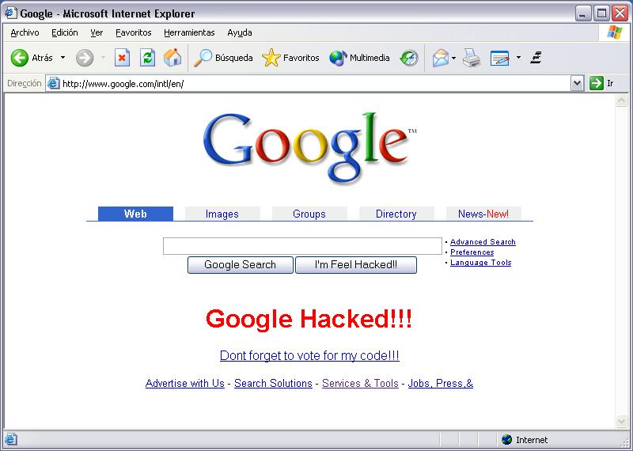



## Intercept and manipulate what a broswer see in your PC

### Description

I DONT KNOW WHY MY OTHER SUBMITION WAS DELETED!!

It was getting high rank.

Well, this is one more recent update.

The idea is NOT to hack nothing.

Is just an example that shows you how to intercept and manipulate the querries from a broswer to certain site.

Check the code and drop a note and VOTE for it.

I hope this one dosent get deleted.

Thanks
 
### More Info
 

             |
---                |---
**Submitted On**   |2002-12-31 22:04:58
**By**             |[ricardo arias](https://github.com/Planet-Source-Code/PSCIndex/blob/master/ByAuthor/ricardo-arias.md)
**Level**          |Beginner
**User Rating**    |3.7 (26 globes from 7 users)
**Compatibility**  |VB 6\.0
**Category**       |[Internet/ HTML](https://github.com/Planet-Source-Code/PSCIndex/blob/master/ByCategory/internet-html__1-34.md)
**World**          |[Visual Basic](https://github.com/Planet-Source-Code/PSCIndex/blob/master/ByWorld/visual-basic.md)
**Archive File**   |[Intercept\_152128112003\.zip](https://github.com/Planet-Source-Code/ricardo-arias-intercept-and-manipulate-what-a-broswer-see-in-your-pc__1-42045/archive/master.zip)

